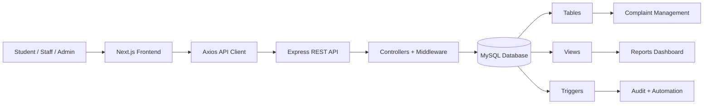
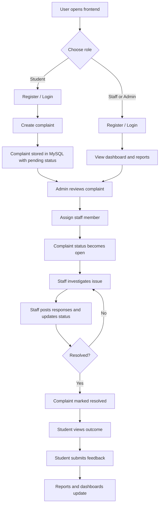

# Campus Desk

A full-stack campus complaint management system built for a DBMS project. It helps students raise complaints, allows staff and admins to track and resolve them, and provides reporting views for operational monitoring.

The repository contains:

- `frontend/`: Next.js 16 + React 19 client
- `backend/`: Express 5 + MySQL API
- `backend/database/schema.sql`: database schema, seed data, views, and triggers

## Overview

Campus Desk centralizes complaint handling for a college or campus environment:

- Students can register, log in, file complaints, track complaint status, and submit feedback after resolution.
- Staff can log in, view assigned complaints, post responses, and update complaint status.
- Admins can assign complaints to staff and access reporting dashboards.
- Reports summarize complaint status, open complaints, staff performance, and average resolution time.

## Features

### Student features

- Student registration and login
- Submit a new complaint with category and priority
- View personal complaint history
- Open complaint detail pages to track status and responses
- Submit feedback with rating after a complaint is resolved

### Staff/Admin features

- Staff/admin registration and login
- View complaint dashboard
- View complaint details and response history
- Add responses to complaints
- Update complaint status
- Admin-only complaint assignment to staff
- Access reports dashboard

### DBMS features used in the project

- Relational schema with foreign keys
- Seeded master data for complaint categories
- SQL views for dashboards and reporting
- SQL triggers for lifecycle automation and audit logging
- Aggregation queries for analytics

## Tech Stack

| Layer | Technology |
| --- | --- |
| Frontend | Next.js 16, React 19, TypeScript, Tailwind CSS 4, Axios |
| Backend | Node.js, Express 5, mysql2, bcryptjs, jsonwebtoken, dotenv |
| Database | MySQL |
| Package manager | pnpm |
| Dev database option | Docker Compose |

## Project Structure

```text
dbms/
|-- backend/
|   |-- database/
|   |   `-- schema.sql
|   |-- src/
|   |   |-- config/
|   |   |-- controllers/
|   |   |-- middleware/
|   |   |-- routes/
|   |   |-- utils/
|   |   |-- app.js
|   |   `-- server.js
|   |-- docker-compose.yml
|   `-- package.json
|-- frontend/
|   |-- app/
|   |-- components/
|   |-- context/
|   |-- lib/
|   `-- package.json
`-- README.md
```

## System Architecture



## Project Workflow



## Database Design

### Core tables

- `category`
- `student`
- `staff`
- `complaint`
- `response`
- `feedback`
- `complaint_audit`

### Database views

- `vw_open_complaints`
- `vw_student_complaint_history`
- `vw_staff_workload`
- `vw_category_stats`

### Database triggers

- `trg_set_resolved_date`
- `trg_feedback_only_on_resolved`
- `trg_audit_status_change`
- `trg_auto_open_on_assign`

These triggers automatically:

- set `date_resolved` when a complaint becomes resolved
- block feedback unless the complaint is resolved
- log status changes into `complaint_audit`
- change a `pending` complaint to `open` when staff is assigned

## API Overview

Base URL:

```text
http://localhost:4000/api
```

### Health

- `GET /health`
- `GET /api/health`

### Students

- `POST /api/students/register`
- `POST /api/students/login`
- `GET /api/students/:id`
- `PATCH /api/students/:id`
- `GET /api/students/:id/complaints`

### Staff

- `GET /api/staff`
- `POST /api/staff/register`
- `POST /api/staff/login`
- `POST /api/staff`
- `GET /api/staff/:id`
- `PATCH /api/staff/:id`
- `DELETE /api/staff/:id`
- `GET /api/staff/:id/complaints`

### Categories

- `GET /api/categories`
- `GET /api/categories/:id`
- `POST /api/categories`
- `PATCH /api/categories/:id`
- `DELETE /api/categories/:id`

### Complaints

- `GET /api/complaints`
- `POST /api/complaints`
- `GET /api/complaints/:id`
- `PATCH /api/complaints/:id`
- `DELETE /api/complaints/:id`
- `PATCH /api/complaints/:id/assign`

### Responses

- `POST /api/responses`
- `GET /api/responses/complaint/:complaintId`

### Feedback

- `POST /api/feedback`
- `GET /api/feedback/complaint/:complaintId`

### Reports

- `GET /api/reports/complaints-by-status`
- `GET /api/reports/complaints-by-category`
- `GET /api/reports/complaints-by-department`
- `GET /api/reports/staff-performance`
- `GET /api/reports/average-resolution-time`
- `GET /api/reports/open-complaints-dashboard`

## Local Setup

### Prerequisites

- Node.js 20+ recommended
- pnpm
- MySQL 8+ or Docker Desktop

### 1. Start the database

You can either use a local MySQL server or the included Docker Compose file.

#### Option A: Docker

From `backend/`:

```bash
docker compose up -d
```

Important:

- The Docker container exposes MySQL on host port `3307`
- If you use Docker, set backend `DB_PORT=3307`

### 2. Create backend environment variables

Create `backend/.env`:

```env
NODE_ENV=development
PORT=4000
DB_HOST=127.0.0.1
DB_PORT=3307
DB_USER=root
DB_PASSWORD=example
DB_NAME=campus_complaints
JWT_SECRET=replace_this_with_a_secure_secret
JWT_EXPIRES_IN=2h
```

If you are using a normal local MySQL installation instead of Docker, change `DB_PORT` to `3306` or whatever your MySQL server uses.

### 3. Import the database schema

Run the SQL file in MySQL:

```bash
mysql -h 127.0.0.1 -P 3307 -u root -p < backend/database/schema.sql
```

This will:

- create the `campus_complaints` database
- create all tables
- insert default categories
- create views and triggers

### 4. Install and run the backend

```bash
cd backend
pnpm install
pnpm dev
```

Backend runs on:

```text
http://localhost:4000
```

### 5. Create frontend environment variables

Create `frontend/.env.local`:

```env
NEXT_PUBLIC_API_URL=http://localhost:4000/api
```

### 6. Install and run the frontend

```bash
cd frontend
pnpm install
pnpm dev
```

Frontend runs on:

```text
http://localhost:3000
```

## Default User Flow

1. Register as a student, staff, or admin.
2. Log in from the frontend.
3. Students submit complaints with category and priority.
4. Admin assigns complaints to a staff member.
5. Staff updates status and adds responses.
6. Students track progress from the dashboard.
7. After resolution, students submit feedback.
8. Staff/admin users review reports and open complaint dashboards.

## Important Implementation Notes

- JWT tokens are issued for both student and staff/admin login flows.
- The frontend stores the token and user object in `localStorage`.
- The Axios client automatically sends the stored token as a Bearer token.
- In the current backend, JWT middleware is applied to student profile and student complaint-history routes. Most staff/admin and management routes are not yet protected, so this version should be treated as a development/academic project rather than a production-secure deployment.
- The current response API requires `staff_id`, so complaint replies are effectively staff/admin-driven in the backend implementation.

## Possible Future Improvements

- Add role-based route protection for all admin and staff operations
- Add dedicated admin UI for category and staff management
- Add validation and form-level error feedback everywhere
- Add automated tests for controllers and frontend flows
- Add email or in-app notifications for complaint updates
- Add charts to the reports dashboard

## Screens Included in the Frontend

- Landing page
- Login page
- Registration page
- Dashboard page
- New complaint page
- Complaint detail page
- Reports page

